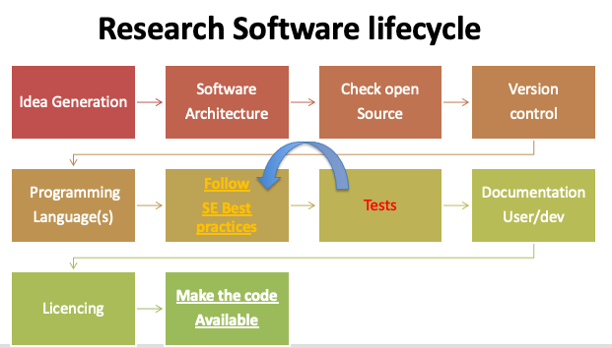
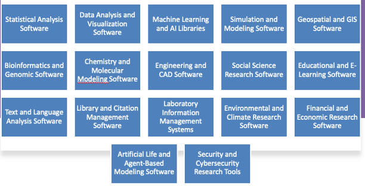
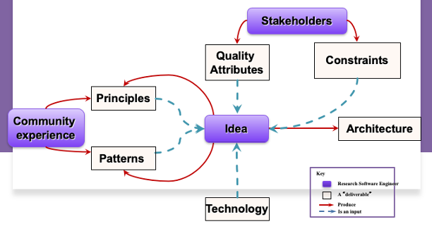
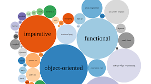
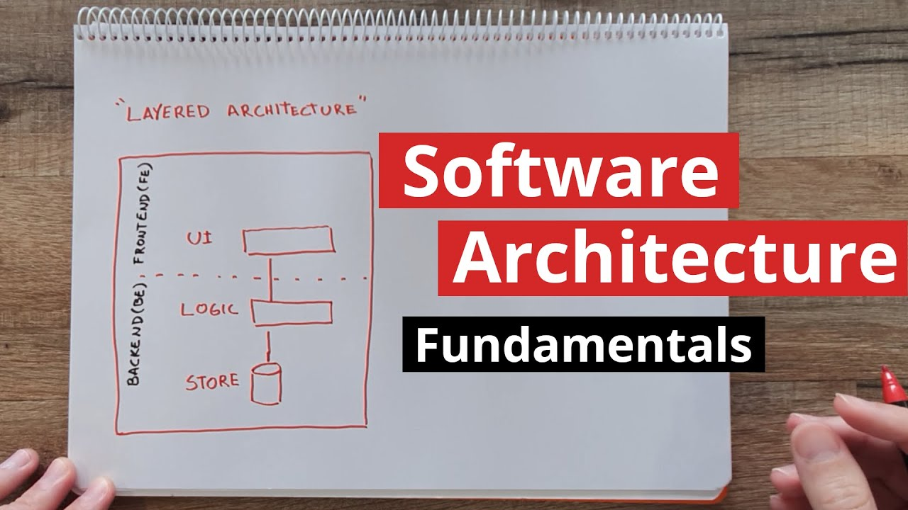
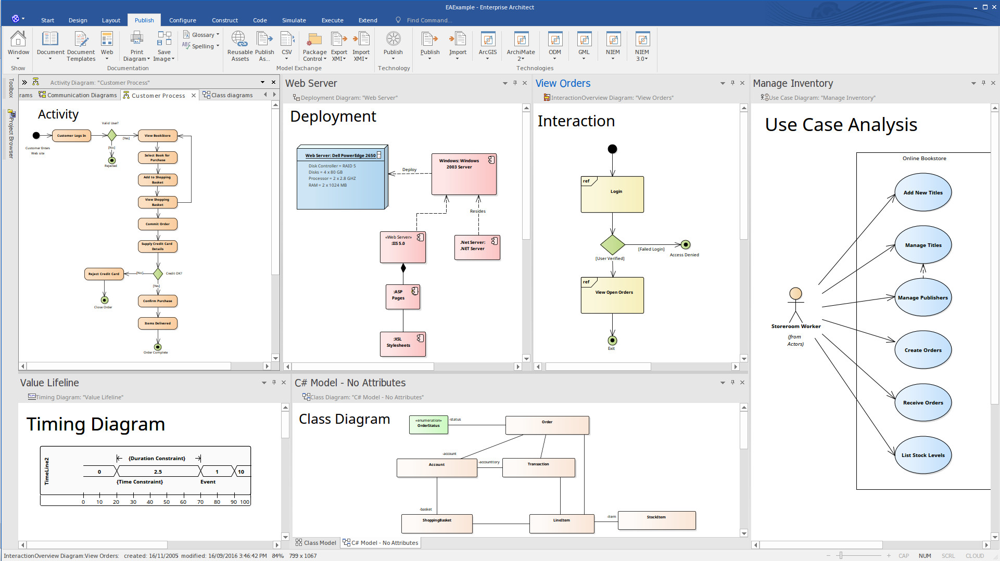
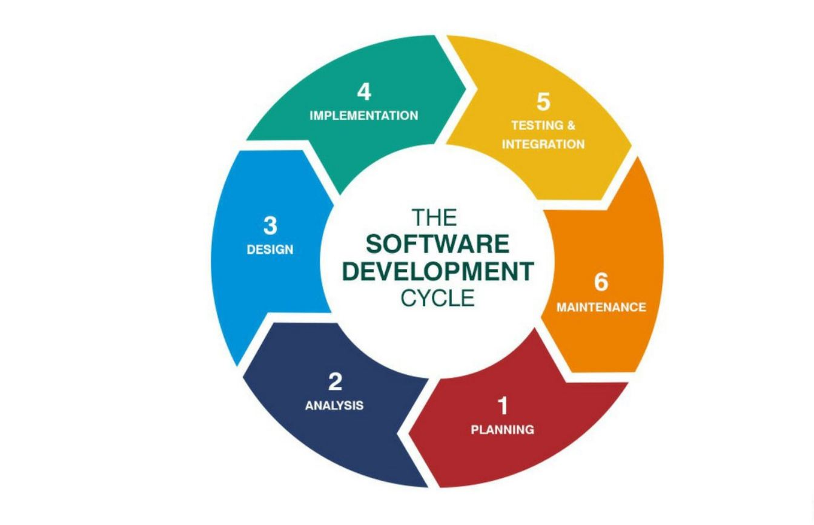
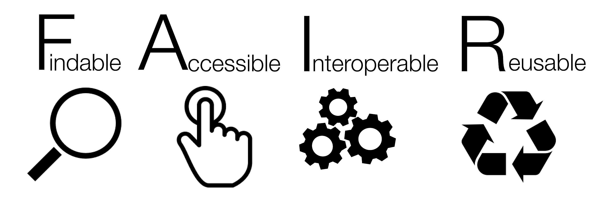

<!-- .slide: data-state="title" -->

# Research Software 

===

<!-- .slide: data-state="standard" -->

## What is research software?
 
- Writing research software involves a unique set of challenges and considerations. 
- Research software development is an iterative process, and adapting to emerging best practices and community standards is crucial for success. 
- Collaboration and open communication with colleagues and the research community are key to producing high-quality research software.

Note: 

Here are some best practices to keep in mind when developing research software:
1. **Plan and Design Carefully:**
   - Start with a clear project plan and research goals.
   - Design your software architecture thoughtfully, with modularity and scalability in mind.
   - Document your software design, including data structures, algorithms, and dependencies.

2. **Version Control:**
   - Use a version control system (e.g., Git) to track changes and collaborate with others.
   - Host your code on platforms like GitHub for easy collaboration and sharing.

3. **Reproducibility:**
   - Make your code and research environment as reproducible as possible.
   - Document dependencies and provide setup instructions.
   - Consider containerization with tools like Docker to encapsulate the environment.

4. **Documentation:**
   - Write clear and comprehensive documentation for your code.
   - Include comments in the code to explain complex logic or algorithms.
   - Use tools like Jupyter Notebooks for interactive documentation.

5. **Testing:**
   - Implement unit tests, integration tests, and validation tests to ensure your software works correctly.
   - Use continuous integration (CI) to automate testing and catch errors early.

6. **Performance Optimization:**
   - Optimize critical parts of your code for efficiency.
   - Use profiling tools to identify bottlenecks.
   - Consider parallelization or GPU acceleration for computationally intensive tasks.

7. **Data Management:**
   - Implement data handling and storage best practices, including data cleaning and validation.
   - Use appropriate data structures and databases for efficient data management.

8. **Licensing:**
   - Choose an open-source license that aligns with your project's goals (e.g., MIT, Apache, or GPL).
   - Clearly specify the license in your project repository.

9. **Collaboration:**
   - Foster a collaborative environment by welcoming contributions from others.
   - Use platforms like GitHub for issue tracking and pull requests.

10. **Security:**
    - Protect sensitive data and prevent security vulnerabilities.
    - Keep libraries and dependencies up to date to address security issues.

11. **User-Friendly Interfaces:**
    - Develop user-friendly interfaces and command-line options.
    - Consider creating graphical user interfaces (GUIs) for non-technical users.

12. **Community Building:**
    - Engage with the research community, present your work, and seek feedback.
    - Consider publishing your code and datasets in repositories like Zenodo or Figshare.

13. **Citation and DOI:**
    - Assign a DOI to your software, making it citable in research publications.
    - Encourage others to cite your work when they use your software.

14. **Maintenance and Sustainability:**
    - Plan for long-term maintenance and updates.
    - Seek funding or support to ensure the sustainability of your research software.

15. **Ethics and Compliance:**
    - Ensure your software complies with ethical guidelines and legal regulations, especially when dealing with sensitive data.

16. **Peer Review:**
    - Consider submitting your software for peer review through platforms like the Journal of Open Source Software (JOSS).

===

<!-- .slide: data-state="standard" -->

## Research Software lifecycle 

| steps | Authors |
| :-- | :-- |
| 1. Conducting Research | Individual / team |
| **<u>Design phase:</u>**  **(2)** Software architecture **(3)** Check open source                                                  | Individual / team |
| **<u>Coding phase:</u>**  **(4)** Choose a language     **(5)** Separation of Concern (Modularity) **(6)** Apply software patterns | Individual / team |
| **<u>Testing Phase:</u>** **(7)** Unit testing / Integration /  Performance / Security                                             | Individual / team |
| **<u>Documentation:</u>** **(8)** User documentation/ developer / Tutorials / publication                                          | Individual / team |
| **<u>Distribution:</u>**  **(9)** Choose a licence **(11.** publication **(12)** make you software public                          | Individual / team |

===

<!-- .slide: data-state="standard" -->

## Research Software lifecycle 

===

<!-- .slide: data-state="standard" -->

## Research software in all scientific disciplines
 

===

<!-- .slide: data-state="standard" -->

## Research software requirements
 

===

<!-- .slide: data-state="standard" -->

## Re-use existing open-Source software

- Available for free*
- Maintained by volunteers
- Documentation not always up to date

<small>Photo by <a href="https://unsplash.com/@stephaniemoarr?utm_content=creditCopyText&utm_medium=referral&utm_source=unsplash">xxxx</a> on <a href="https://unsplash.com/photos/person-holding-white-ceramic-mug-DGt9zA3Fr0g?utm_content=creditCopyText&utm_medium=referral&utm_source=unsplash">xxxx</a></small>

 

Note: 

How-to
 - **How:** Search engines: searchcode.com" or "searchcode.com
 - **Where:** Platforms and directories for open-source software, such as GitHub, GitLab, SourceForge, and Bitbucket
 - **Easy Install**: Package Mangers: make it easy to find and install open-source libraries: pip (Python), npm(Node.js), and RubyGems,(Ruby) …
 - **Under a License**: Apache, MIT, GPL, LGPL, BCD  CC*
 - A software license is a legal agreement that define the terms and conditions under which software can be used, distributed, modified, and shared

These licenses serve to protect the rights of the software developer while also defining what users are allowed to do with the software. 
Here are some key components typically found in software licenses:

1. **License Grant:** This section describes what the software license allows users to do. It may specify whether the software can be used, copied, modified, or distributed.

2. **Restrictions:** These are limitations placed on the user, such as restrictions on reverse engineering, decompiling, or using the software for specific purposes.

3. **Usage Terms:** This section may include usage terms, such as the number of users or devices that can use the software, the duration of the license, and whether the license is transferable.

4. **Distribution:** If the software can be distributed, the license may specify the conditions under which it can be shared or sold.

5. **Modification:** If users are allowed to modify the software, the license might specify the terms for sharing those modifications, including whether they must be open source or can remain proprietary.

6. **Attribution:** Some licenses require users to provide attribution to the original software developer in their own work.

7. **Warranty and Liability:** This section outlines the warranty, if any, provided with the software. It may also specify the extent of liability of the software developer for any damages or issues arising from the software's use.

8. **Termination:** The license may include conditions under which it can be terminated, such as non-compliance with the license terms.

9. **Governing Law:** This indicates which jurisdiction's laws will govern the license agreement.

Common types of software licenses include open source licenses like the MIT License, Apache License, and GNU General Public License (GPL), as well as proprietary licenses used for commercial software. Each type of license comes with its own set of terms and conditions, ranging from highly permissive (e.g., MIT License) to more restrictive (e.g., some proprietary licenses).

It's essential to carefully read and understand the terms of a software license before using or distributing the software, as violation of the license terms can have legal consequences. Additionally, some licenses are not compatible with one another, so it's crucial to ensure that the software's licenses align with your intended use and distribution.

===

<!-- .slide: data-state="standard" -->

## Programming 

 There are several programming paradigms, which are different approaches to writing code and structuring programs

- Procedural Programming
 - Object-Oriented Programming 
 - Functional Programming 
 - Declarative Programming
 - Logic Programming
 - Concurrent and Parallel Programming
 - Event-Driven Programming

<small>Photo by <a href="https://unsplash.com/@stephaniemoarr?utm_content=creditCopyText&utm_medium=referral&utm_source=unsplash">xxxx</a> on <a href="https://unsplash.com/photos/person-holding-white-ceramic-mug-DGt9zA3Fr0g?utm_content=creditCopyText&utm_medium=referral&utm_source=unsplash">xxxx</a></small>

Note: 

- Don’t get into religious programming discussion and attitude.
- Choose based on what fits best
  - Expressiveness
  - Ease of use
  - Eco-systems (libraries, tools for debugging, community)
- Imperative Programming: In imperative programming, you provide explicit instructions for the computer to follow, specifying the sequence of steps to achieve a particular result. Languages like C, C++, and Pascal are often associated with this paradigm.
- Procedural Programming: Procedural programming is a subset of imperative programming where code is organized into procedures or functions. It promotes code reusability and maintainability. C and Pascal are examples of languages that support procedural programming.
- Object-Oriented Programming (OOP): In OOP, programs are structured around objects, which encapsulate data and behavior. Key concepts include classes, inheritance, and polymorphism. Java, C++, and Python are popular OOP languages.
- Functional Programming (FP): Functional programming treats computation as the evaluation of mathematical functions and avoids changing state and mutable data. It relies heavily on functions as first-class citizens. Languages like Haskell, Lisp, and Erlang are associated with this paradigm.
- Declarative Programming: In declarative programming, you specify what you want to achieve without detailing how it should be done. SQL, for example, is a declarative language used for querying databases.
- Logic Programming: Logic programming is based on formal logic and rule-based systems. Prolog is a well-known logic programming language used for symbolic reasoning and knowledge representation.
- Event-Driven Programming: This paradigm is common in GUI programming and systems where code responds to events or messages. Event-driven languages include JavaScript and Python (with libraries like Tkinter).
Aspect-Oriented Programming (AOP): AOP is a complement to OOP. It focuses on separating cross-cutting concerns (e.g., logging, security) from the main program logic. AspectJ is a popular AOP extension for Java.
- Concurrent and Parallel Programming: These paradigms address multi-threading, parallel processing, and synchronization. Languages like Go, Erlang, and Java provide features for concurrent and parallel programming.
- Meta-Programming: Meta-programming is a programming technique where code generates, modifies, or analyzes other code. It's often used in code generation and domain-specific languages.
- Scripting: Scripting languages are designed for quick, dynamic, and interpreted scripting tasks. Python, Ruby, and - JavaScript are scripting languages commonly used for automation and web development.
- Array Programming: Array programming emphasizes operations on entire arrays rather than individual elements. Languages like MATLAB and NumPy (Python library) support array programming.
- Reactive Programming

===

<!-- .slide: data-state="standard" -->

## Programming Languages

<!-- -->

Don’t get into religious programming discussion and attitude\.
- Choose based on what fits best
  - Expressiveness
  - Ease of use
  - Eco-systems (libraries, tools for debugging, community)

 

<small>Photo by <a href="https://unsplash.com/@stephaniemoarr?utm_content=creditCopyText&utm_medium=referral&utm_source=unsplash">xxxx</a> on <a href="https://unsplash.com/photos/person-holding-white-ceramic-mug-DGt9zA3Fr0g?utm_content=creditCopyText&utm_medium=referral&utm_source=unsplash">xxxx</a></small>

Note: 

[https://en.wikipedia.org/wiki/Comparison_of_multi-paradigm_programming_languages](https://en.wikipedia.org/wiki/Comparison_of_multi-paradigm_programming_languages) 

===

<!-- .slide: data-state="standard" -->

## Software Architecture

Design
- Functional vs Non-functional requirements
- Architecture style
- Component design
- Software patterns
- Scalability
- Security Performance
- Deployment and hosting
- Monitoring and logging
- Compliance and standards
- Change management
- Review and validation

<small>Photo by <a href="https://unsplash.com/@stephaniemoarr?utm_content=creditCopyText&utm_medium=referral&utm_source=unsplash">xxxx</a> on <a href="https://unsplash.com/photos/person-holding-white-ceramic-mug-DGt9zA3Fr0g?utm_content=creditCopyText&utm_medium=referral&utm_source=unsplash">xxxx</a></small>

<!--  -->

Note:
 - Use appropriate Tools:
   - provide features for creating architectural diagrams, defining components, and visualizing the structure of a software system

[https://softwarearchitecture.tools/#diagramming-tools](https://softwarearchitecture.tools/#diagramming-tools)

<!--   --> 

===

<!-- .slide: data-state="standard" -->

# Software engineering best practices

- Modular and Scalable Design
- Version control
- Coding Standards (Readability/code formatting)
- Test-Driven Development
- Code Reviews
- continuous Integration (CI) and Continuous Delivery (CD)
- Bug Tracking and Issue Management
- Security Practices
- Performance Optimization
- User Experience (UX) and Usability
- Documentation

Note:

Use of Integrated Development Environment (IDE)

https://sourceforge\.net/directory/integrated\-development\-environments\-ide/mac/

===

<!-- .slide: data-state="standard" -->

## DevOpsTeam development

- DevOps foster a culture of collaboration and continuous improvement
   - practices, principles enhance collaboration  and communication between software development and IT operations teams
- The primary objective is to
  - increase the speed, quality, and reliability
  - Continuous integration (CI)
  - Monitoring and Feedback
  - Security
  - Microservices and containers
  - Scalability and Resilience
  - DevOps toolchain

Note:

- DevOpsis not a one-size-fits-all approach, and its implementation can vary depending on an organization's specific needs and constraints.The primary objective is to increase the speed, quality, and reliability of software delivery

===

<!-- .slide: data-state="standard" -->

## Reusability of Research software

- Does following SE best practices guarantee re-usability and user adoption?
  - it should in increase adoption,
  - Beyond FAIR

Note:

- Identify
  - the competition
  - the Unique seling point
- Reach out potential
  - Tutorials/demos/papers
- Dont forget to make the software repository public

===

<!-- .slide: data-state="standard" -->

## Takeaway

- Developing a software is
  - a long and tedious process
  - it worth to defend and sustaining but not at all costs
- Suggestions: 
  - Don’t fall in Love with your software When needed drop it and use another solution

===

<!-- .slide: data-state="keepintouch" -->

www.esciencecenter.nl

info@esciencecenter.nl
 
020 - 460 47 70   
